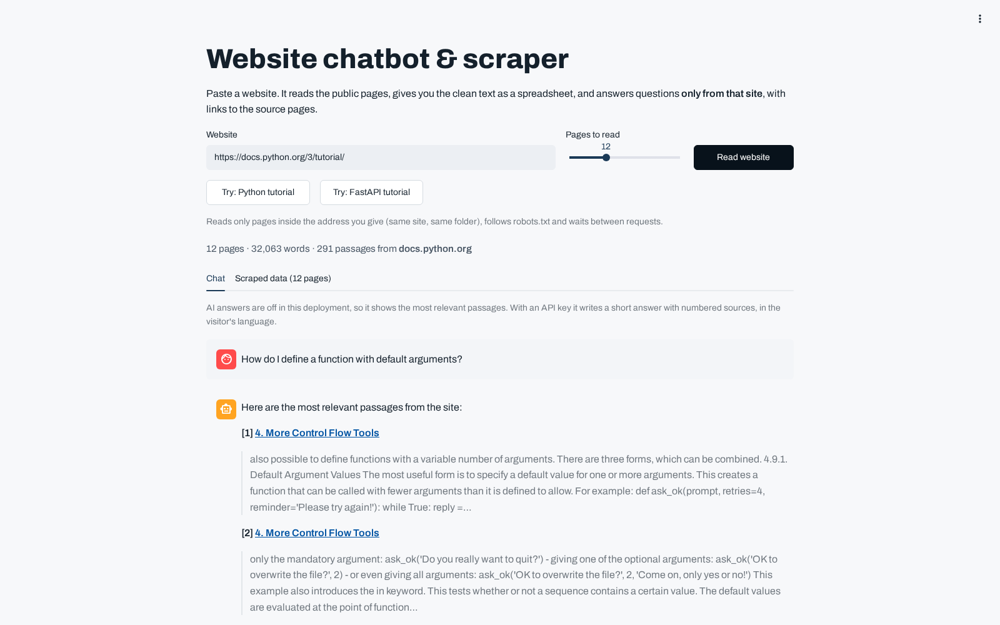

# Website chatbot & scraper

**Live demo:** https://slimaneoptic-chatbot.streamlit.app

Paste a website. It reads the public pages, gives you the clean text as CSV or JSON, and answers questions **only from that site**, with links to the source pages.



## Features
- **Polite crawler:** stays inside the given site and folder, follows robots.txt, waits between requests, and caps page size.
- **Safe for a public demo:** refuses private or internal network addresses, re-checked on every redirect.
- **Clean extraction:** main text only (menus, footers and ads removed) via trafilatura.
- **Search:** passages ranked with BM25+, which works on small sites too.
- **Answers (with an API key):** an AI model (free models via OpenRouter by default) streams a short answer, cites the passages it used, and says so when the site doesn't cover the question.
- **Without a key, or when every model is busy:** shows the most relevant passages with source links.
- **Export:** CSV and JSON of every page read.

## Run locally
```bash
pip install -r requirements.txt
export OPENROUTER_API_KEY=your-key   # optional
streamlit run app.py
pytest -q tests
```
Optional: `OPENROUTER_MODELS="model-a,model-b"` overrides the model list (default: free models, see `llm.py`).

## Need this for your business?
An assistant for your website, help center or PDFs, with an embeddable chat widget, lead capture, WhatsApp or email handoff, scheduled re-indexing, and reports on unanswered questions. https://www.upwork.com/freelancers/~01d6ae0f1a06a43ac0
